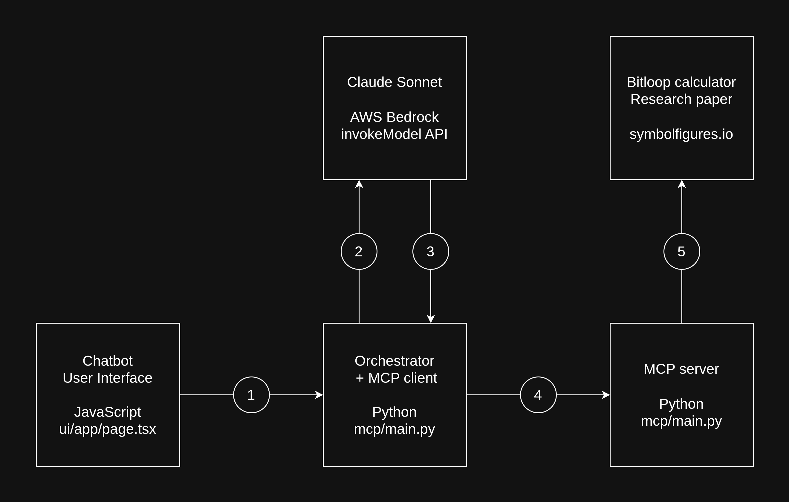
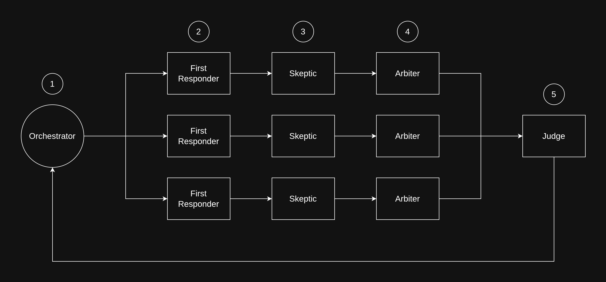

# Bitloops Chatbot

A chatbot that answers questions about bitloops using the research paper and bitloop calculator.

It uses Model Context Protocol to let a LLM use these resources. 

## Overview

The overal request flow is as follows:

1. The user asks a question using a chatbot interface.
2. An orchestrator sends the question to Anthropic Claude via AWS Bedrock API.
3. Claude makes a tool call if it thinks the resulting information will help answer the question.
4. The MCP client make the tool call to the MCP server.
5. The MCP server retrieves information from the available tools.

The path then continues in reverse, sending the information back to Claude, which provides a final answer.

## Orchestration

The Orchestrator may call Claude several times as though multiple LLMs worked together as a group to figure out the right answer.

1. The Orchestrator initiates two identical sequences in parallel. Each sequence is a deliberation of three LLMs.
2. The First Responder simply answers the question as one would expect, using tools as needed.
3. The Skeptic is asked to read the answer and point out anything it finds is incorrect.
4. The Arbiter reads both answers and synthesizes them into its own answer.
5. The Judge reads two answers and decides which one is the best, and returns it to the Orchestrator.

The Bedrock API includes a system prompt to define these [roles](mcp/roles.py).

### Orchestration

Here is an example question and a common outcome:

`Take the bitloop '1100101'. Is this bitloop equal to its link?`

The First Responder always gets this wrong. It uses the Bitloop Calculator to find the link of `1100101`, which is `0010111`, and says these bitstrings are not equal, hence the given bitloop is not equal to its link.

The Skeptic recognizes that a bitloop may be represented by any member of its rotation class, and both bitstrings `1100101` and `0010111` belong to the same rotation class. Therefore the bitloop is equal to its link.

The Arbiter agrees with the Skeptic and writes its own answer. The Arbiter gets it right about 75% of the time (151/200 trials).

If the analysis is run twice so there are two Arbiters, the probabilities follow:

Outcome | Probability
---|---
2 wrong | 6.25%
1 wrong and 1 right | 37.5%
2 right | 56.25%

A Judge is introduced to take both answers and determine which is right.

Outcome | Judge's accuracy
---|---
2 wrong | 16.7% (1/6)
1 wrong and 1 right | 64.9% (13/37)
2 right | 100% (57/57)

This results in a 6.5% increase in accuracy.

Role | LLM calls | Accuracy
---|---|---
First Responder | 1 | 0.0%
Arbiter | 3 | 75.5%
Judge | 7 | 82%

Each role is prompted to use the research paper to inform their response. Reading it once consumes about 17,000 tokens. Including cachePoint in the Bedrock API call caches this part of the system prompt, so it only needs to be read once. It's saved for later queries as well. For this to work, the prompt needs to explicitly tell the model to review the research paper in the system context.

### Research Paper Ingestion

The original research paper was written for a human audience, not a LLM.

Overall accuracy increased from 82% to 94% by rewriting the research paper, chainging the format from [HTML](https://symbolfigures.io/bitloops.html) to [YAML](https://symbolfigures.io/bitloops/bitloops.yml). The same orchestration process is still needed for accuracy.

Role | HTML | YAML
---|---|---
First Responder | 0.0% | 0.0%
Arbiter | 75.5% | 78.5%
Judge | 82% | 94%

The YAML format also opens the door to selective retrieval. Like the functions in an MCP tool, the LLM would receive a list of concepts and request details of any that appear relevant. In this case the paper is small enough that the entire thing can be passed in, thus avoiding the additional complexity.